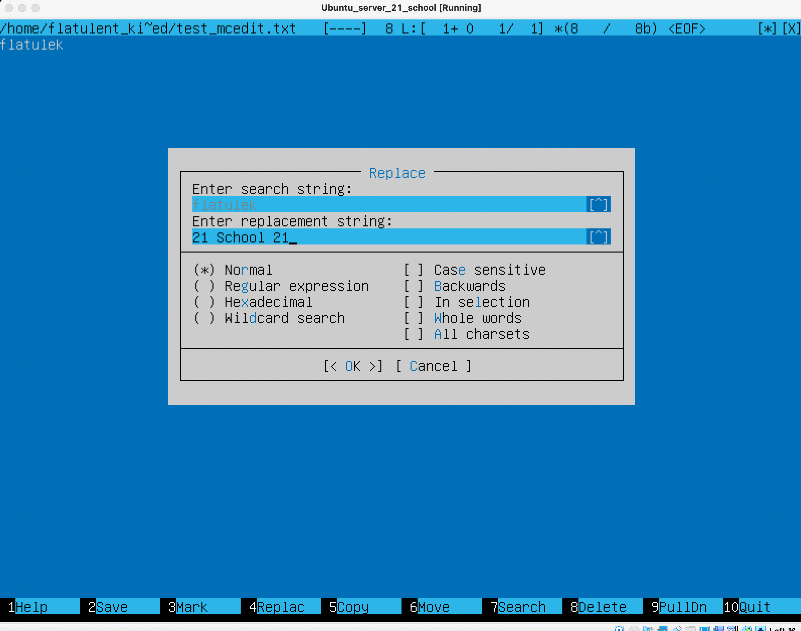

# Операционные системы UNIX/Linux (Базовый).
Установка и обновления системы Linux. Основы администрирования.

## Contents
1 [Установка ОС](#part-1-установка-ос)  
2 [Создание пользователя](#part-2-создание-пользователя)  
3 [Настройка сети ОС](#part-3-настройка-сети-ос)   
4 [Обновление ОС](#part-4-обновление-ос)  
5 [Использование команды  sudo](#part-5-использование-команды-sudo)  
6 [Установка и настройка службы времени](#part-6-установка-и-настройка-службы-времени)  
7 [Установка и использование текстовых редакторов](#part-7-установка-и-использование-текстовых-редакторов)  
8 [Установка и базовая настройка сервиса SSHD](#part-8-установка-и-базовая-настройка-сервиса-sshd)   
9 [Установка и использование утилит top, htop](#part-9-установка-и-использование-утилит-top-htop)   
10 [Использование утилиты fdisk](#part-10-использование-утилиты-fdisk)   
11 [Использование утилиты df](#part-11-использование-утилиты-df)   
12 [Использование утилиты du](#part-12-использование-утилиты-du)   
13 [Установка и использование утилиты ncdu](#part-13-установка-и-использование-утилиты-ncdu)    
14 [Работа с системными журналами](#part-14-работа-с-системными-журналами)     
15 [Использование планировщика заданий CRON](#part-15-использование-планировщика-заданий-cron)  

## Part-1-установка-ос
- 
   Установка состоит из основных шагов:   
   Загрузка образа   
   Запись на загрузочный носитель   
   Запуск установщика образа   
   Выбор языка   
   Обновление загрузщика(опционально)   
   Настройка: раскладки, сети, прокси, ssh, выбор сервера репозитория   
   Разметка диска   
   Создание пользователя, настройка имени машины   
   Выбор приложений для установки   
   
   После завершения установки и перезагрузки, авторизуемся в системе,вводя логин и пароль.   
   Для того, чтобы проверить версию ОС нужно вввести команду: ``cat /etc/issue``

    

## Part-2-создание-пользователя
-

1.  Создание нового пользователя ``sudo useradd -G adm flatulent_kindred``

2.  Просмотр нового пользователя ``cat /etc/passwd``
    

## Part-3-настройка-сети-ос

- ##### 1. Задать название машины вида пользователь_1 (имя пользователя из Part 2): 

    ``sudo nano /etc/hostname`` - далее изменила название в редакторе
      
    
- ##### 2. Установка временной зоны:
    ``sudo timedatectl set-timezone Asia/Novosibirsk``
      

- ##### Вывод названия сетевых интерфейсов с помощью консольной команды: 

3. Просмотрела сетевые интефейсы - ``ifconfig -a``
     

    Сетевой интерфейс — физическое или виртуальное устройство, предназначенное для передачи данных между программами через компьютерную сеть.
    Сетевое взаимодействие Linux-компьютера происходит через сетевые интерфейсы. Любые данные, которые компьютер отправляет в сеть или получает из сети проходят через сетевой интерфейс.
    Интерфейс определён реализацией модели TCP/IP для того чтобы скрыть различия в сетевом обеспечении и свести сетевое взаимодействие к обмену данными с абстрактной сущностью.
    lo - это    интерфейс петли обратной связи.
    Одна из задач технологии обратной петли — перенаправлять исходящий системный пакет на вход системы, не давая ему попасть к OSI. Если попроще, вот так работает данный интерфейс: Кроме того, интерфейс loopback осуществляет взаимодействие исполняемых на одном хосте процессов с сетевой подсистемой. Есть и полная схема осуществления loopback интерфейса: Сфера применения интерфейса обратной петли довольно объемная. Ее используют и в системе pfSense — дистрибутив, создающий межсетевой экран/машрутизатор. В таком случае loopback нужен в качестве метода взаимодействия между локальными процессами через сетевую подсистему.

- ##### Для получения ip адреса устройства от DHCP сервера.

4. Используя консольную команду ``sudo dhclient -v`` получить ip адрес устройства
    

    Протокол динамической настройки хоста (DHCP) — это сетевая служба, которая позволяет хост-компьютерам автоматически назначать настройки с сервера, а не вручную настраивать каждый сетевой хост. 
    Клиент настроенный на получение адреса по протоколу DHCP посылает запрос к серверу, и тот в свою очередь предоставляет свободный IP адрес клиенту во временное пользование — так сказать в аренду (в дальнейшем я буду это так и называть). Срок аренды IP адреса настраивается на сервере. DHCP позволяет значительно уменьшить затраченное время на настройку сети, так же позволяет подключать клиента из одной сети в другую без изменения сетевых параметров. Для провайдеров услуг — DHCP позволяет съэкономить на пуле IP адресов, и присвоить статический IP любому оборудованию.

- ##### Определить и вывести на экран внешний ip-адрес шлюза (ip) и внутренний IP-адрес шлюза, он же ip-адрес по умолчанию (gw):

5.  Определила внешний ip-адрес шлюза ``curl ifconfig.me/ip`` (ip) 
    

    внутренний IP-адрес шлюза ``ip route``
    

- ##### Задать статичные (заданные вручную, а не полученные от DHCP сервера) настройки ip, gw, dns (использовать публичный DNS серверы, например 1.1.1.1 или 8.8.8.8).

6. Cетевые настройки осуществляются с помощью редактирования - sudo nano /etc/netplan/00-installer-config.yml  

Корректируем через nano, и получаем:
  

Для применения настроек выполнить sudo netplan generate, и sudo netplan apply, , перезагружаем через `reboot`
   

- ##### Перезагрузить виртуальную машину. Убедиться, что  статичные сетевые настройки (ip, gw, dns) соответствуют заданным в предыдущем пункте. Успешно пропинговала 

  
  

## Part-4-обновление-ос

 - ##### Обновить систему до последней версии.
    

## Part-5-использование-команды-sudo
- ##### Разрешить пользователю, созданному в [Part 2](#part-2-создание-пользователя), выполнять команду sudo.

Sudo (англ.Substitute User and do, дословно «подменить пользователя и выполнить») — программа для системного администрирования UNIX-систем, позволяющая делегировать те или иные привилегированные ресурсы пользователям с ведением протокола работы. Основная идея — дать пользователям как можно меньше прав, при этом достаточных для решения поставленных задач. Sudo - это альтернатива su для выполнения команд с правами суперпользователя (root). В отличие от su который запускает оболочку с правами root и даёт всем дальнейшим командам root права, sudo предоставляет временное повышение привилегий для одной команды. Предоставляя привилегии root только при необходимости, использование sudo снижает вероятность того, что опечатка или ошибка в выполняемой команде произведут в системе разрушительные действия.

Поменять hostname ОС от имени пользователя, созданного в пункте Part 2. (используя sudo).

Сперва добавим пользователя в список /etc/sudoers Это делается с помощью команды visudo Синтаксис такой - [username][any-hostname]=([run-as-username]:[run-as-groupname]) [commands-allowed]

Из под юзера с админ правами редактируем конфиг sudoers:
Поменял хост найм от имени 2 польз. ``sudo hostname flatulent_kindred`` 
    
Разлогиниваемся через logout, и заходим на 2ого пользователя, и проверяем что имя хоста меняется
    

## Part-6-установка-и-настройка-службы-времени

 - ##### Настроить службу автоматической синхронизации времени.

Включаем использование systemd-timesyncd для синхронизации времени: timedatectl set-ntp true

Включаем и перезапускаем службу systemd-timesyncd:

systemctl enable --now systemd-timesyncd.service

systemctl restart systemd-timesyncd.service

Проверяем статус: `systemctl status systemd-timesyncd.service`
    

Запустив `timedatectl status` в успешном случае в строке NTP service должно быть active
    

## Part-7-установка-и-использование-текстовых-редакторов

 - ##### Установить текстовые редакторы **VIM** , **NANO**, **MCEDIT**.
 Устанавливаем нужные приложения через `sudo apt-get install`

1. - ##### Используя каждый из трех выбранных редакторов, создалв файл *test_X.txt*, где X -- название редактора, в котором создан файл. Написвала в нём свой никнейм, закрыла файл с сохранением изменений.

**VIM**
Создала файл test_vim.txt в vim, для выхода с сохранением изменений - esc - SHFT + : - qw  - name file
    

**NANO**
Создала файл test_nano.txt в nano, жмём Ctrl + O для сохранения, Ctrl + X для выхода
    

 **MCEDIT**
Создала файл text_mcedit.txt в mcedit, жмём F2 для сохранения, подтверждаем изменения и имя файла, F10 для выхода
    

2. - ##### Используя каждый из трех выбранных редакторов, откройте файл на редактирование, отредактируйте файл, заменив никнейм на строку "21 School 21", закройте файл без сохранения изменений.
   
  **VIM**
    Для выделения слова вводим `vw`, ввести нужную строку вручную или вставить из буфера(если она там есть)
    **Вставить** - `p`
    **:q!** - закрыть редактор без сохранения
    

  **NANO**
    Перемещаем курсор на начало слова CTRL+ ЛЕВО\ПРАВО, удаляем на del, ввести нужную строку вручную или вставить из буфера(если она там есть)
    **Вставить** - `Ctrl-u`
    Ctrl + X для выхода, N для без сохранения;
    

  **MCEDIT**
    Перемещаем курсор на начало слова CTRL+ ЛЕВО\ПРАВО, удаляем на del,  ввести нужную строку вручную или вставить из
    буфера(если она там есть)
    **Вставить** - `insert`
    **F10** - закрыть редактор, отказаться от сохранения перед закрытием выбрав `No`
    

3. - ##### Используя каждый из трех выбранных редакторов, отредактируйте файл ещё раз (по аналогии с предыдущим пунктом), а затем освойте функции поиска по содержимому файла (слово) и замены слова на любое другое.

  **VIM** 

Для поиска и замены::%s/искать/заменить/g

Для поиска: /шаблон . n - продолжить поиск вперед, N - продолжить поиск назад
    
    
    
  **NANO**

Для поиска и замены: `cmd + R`
    

Поиск- Ctrl-w Найти следующее вхождение - Alt-w или Ctrl-w Enter
    

  **MCEDIT**
    
Для поиска и замены:`F4`, ввести искомую и строку замены, подтвердить замену
    
    Просто для поиска  `F7`
    

## Part-8-установка-и-базовая-настройка-сервиса-sshd  
1. - ##### Установить службу SSHd.  Для установки ssh службы `sudo apt install openssh-server`
    После завершения установки служба SSH запустится автоматически. Проверила, работает ли SSH, набрав: `systemctl status sshd`
    Если не запущена, попробовать запустить- `sudo systemctl start ssh`
    
2. Добавила автостарт службы, набрав: `sudo systemctl enable ssh`
   

3. ##### Перенастроить службу SSHd на порт 2022.  Все настройки сервера SSH хранятся в конфигурационном файле `/etc/ssh/sshd_config`
    
    Чтобы сменить порт меняем значение в строчке Port. 	-_-
    

4. Используя команду ps, показал наличие процесса sshd

Команда ps выводит список текущих процессов на вашем сервере.
Флаг -с для фильтрации по группам 
        ``ps -C sshd``
    

Перезагружаемся - reboot    

5. Для установки netstat sudo apt install net-tools

Проверяем, вывод команды netstat -tan должен содержать tcp 0 0 0.0.0.0:2022 0.0.0.0:* LISTEN
    

- #### значение столбцов вывода

    Proto > Протокол (tcp, udp, raw), используемый сокетом.
    
    Recv-Q > Счётчик байт не скопированных программой пользователя из
    этого сокета.
    
    Send-Q > Счётчик байтов, не подтверждённых удалённым узлом.
    
    Local Address > Адрес и номер порта локального конца сокета. Если не
    указана опция **--numeric** (**-n**), адрес сокета преобразуется в
    каноническое имя узла (FQDN), и номер порта преобразуется в
    соответствующее имя службы.
    
    Foreign Address > Адрес и номер порта удалённого конца сокета.
    Аналогично "Local Address."
    
    State > Состояние сокета.
    
 - #### значение ключей 
    -t по протоколу TCP
    -a показывать состояние всех сокетов;
    -n показывать сетевые адреса как числа
    
 - #### значение  0.0.0.0
    
    **0.0.0.0** — это самый первый IP адрес. Но он относится к IP специального назначения (как например 127.0.0.1) и выполняет разные
    функции.
    
    Когда говорят о прослушиваемых портах, это обозначение в Linux
    символизирует заполнитель, то есть означает «любой IP адрес».
    
    В программе **netstat** также используется запись **0.0.0.0:***
    которая также обозначает «любой IPv4 адрес с любого порта».

## Part 9. Установка и использование утилит **top**, **htop**

- ##### Установить и запустить утилиты top и htop. 
   
       sudo apt install top
       sudo apt install htop
    
  - **top**  - интерактивный просмотрщик процессов

Ввела команду top 
Cписок процессов
    

pid процесса занимающего больше всего памяти 
    ``ps -eo pid,ppid,cmd,%mem --sort=-%mem | head``

pid процесса, занимающего больше всего процессорного времени
    ``top -o %MEM -b -n 1|head -n 12|tail -6``
-A, -e, (a) - выбрать все процессы;
-a - выбрать все процессы, кроме фоновых;
-d, (g) - выбрать все процессы, даже фоновые, кроме процессов сессий;
-N - выбрать все процессы кроме указанных;
-С - выбирать процессы по имени команды;
-G - выбрать процессы по ID группы;
-p, (p) - выбрать процессы PID;
--ppid - выбрать процессы по PID родительского процесса;
-s - выбрать процессы по ID сессии;
-t, (t) - выбрать процессы по tty;
-u, (U) - выбрать процессы пользователя.
Опции форматирования:

-с - отображать информацию планировщика;
-f - вывести максимум доступных данных, например, количество потоков;
-F - аналогично -f, только выводит ещё больше данных;
-l - длинный формат вывода;
-j, (j) - вывести процессы в стиле Jobs, минимум информации;
-M, (Z) - добавить информацию о безопасности;
-o, (o) - позволяет определить свой формат вывода;
--sort, (k) - выполнять сортировку по указанной колонке;
-L, (H)- отображать потоки процессов в колонках LWP и NLWP;
-m, (m) - вывести потоки после процесса;
-V, (V) - вывести информацию о версии;
-H - отображать дерево процессов;

- **htop** – основанный на ncurses просмотрщик процессов подобный top, интерактивные просмотрщики процессов, но позволяющий прокручивать список процессов вертикально и горизонтально, чтобы видеть их полные параметры запуска. Управление процессами (остановка, изменение приоритета) может выполняться без ручного ввода их идентификаторов.

Ввела команду htop 

список процессов 
    

отсортированному по PID
    
    
отсортированному по PERCENT_CPU
    

отсортированному по PERCENT_MEM
    

отсортированному по TIME
    

отфильтрованному для процесса sshd
    

с процессом syslog, найденным, используя поиск
    

с добавленным выводом hostname, clock и uptime
    

## Part-10-использование-утилиты-fdisk

 - ##### Запустить команду `sudo fdisk -l.`
    

        название жесткого диска: VBOX HARDDISK
        его размер : 16 GiB
        количество секторов: 33554432
        размер swap 1G

## Part-11-использование-утилиты-df 

 - ##### Запустить команду df для корневого раздела (/) 

    
        
        - размер раздела 16400252
        - размер занятого пространства 6605320
        - размер свободного пространства 8939844
        - процент использования 43%
        - единица измерения в выводе - килобайт.  
      

    ##### Запустить команду df -Th для корневого раздела (/)

      
          
        - размер раздела 16G
        - размер занятого пространства 6.3G
        - размер свободного пространства 8.6G
        - процент использования 43%
        - тип файловой системы для раздела ext4

## Part-12-использование-утилиты-du 

 - ##### Запустить команду du.
   
##### Вывести размер папок /home, /var, /var/log (в байтах,  в человекочитаемом виде) 

##### Вывести размер всего содержимого в /var/log (не общее, а каждого вложенного элемента, используя *) 
so

## Part-13-установка-и-использование-утилиты-ncdu

 - ##### Установить утилиту ncdu.
   
       sudo apt install ncdu
   
   ##### Вывести размер папок /home, /var, /var/log. sudo ncdu **  
    ncdu /home
    
    
    ncdu /var
    

    ncdu /var/log
    

## Part-14-работа-с-системными-журналами

 - ##### Открыть для просмотра:
   ##### 1. /var/log/dmesg — содержит информацию о кольцевом буфере ядра. Когда система загружается, она выводит на экран ряд сообщений, отображающих информацию об аппаратных устройствах, обнаруженных ядром в процессе загрузки.
    
   ##### 2. /var/log/syslog - регистрирует все, кроме сообщений, связанных с авторизацией.
   ##### 3. /var/log/authlog — содержит информацию об авторизации системы, включая логины пользователей и используемые механизмы аутентификации.

/var/log/auth.log
    

время последней успешной авторизации, имя пользователя и метод входа в систему.
    

Перезапустить службу SSHd - sudo systemctl restart ssh

в syslog - сообщение о рестарте службы
    
Остановлен и перезапущен SSH:
    

## Part-15-использование-планировщика-заданий-cron

##### Используя планировщик заданий, запустите команду uptime через каждые 2 минуты
$crontab -e и выберите текстовый редактор - для редактирования файла конфигурации. $ */2 * * * * uptime - добавлена ​​новая задача. Строки в системных логах (минимум две в заданном временном диапазоне) о выполнении:
    
   
    
- Найти в системных журналах строчки (минимум две в заданном временном диапазоне) о выполнении.
- Вывести список текущих заданий для CRON $ crontab -l:

   
  
- Команда Uptime запускается каждые две минуты, grep -i cron /var/log/syslog:

  

##### Удалите все задания из планировщика заданий.

$crontab -r — удалить все задачи; $crontab -l — перечислить все задачи; Список текущих задач для CRON:
    
   
